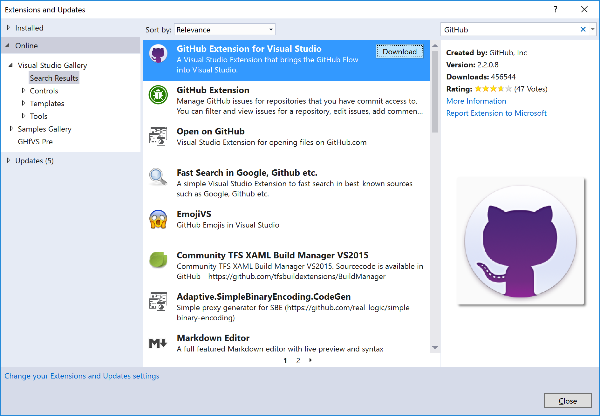
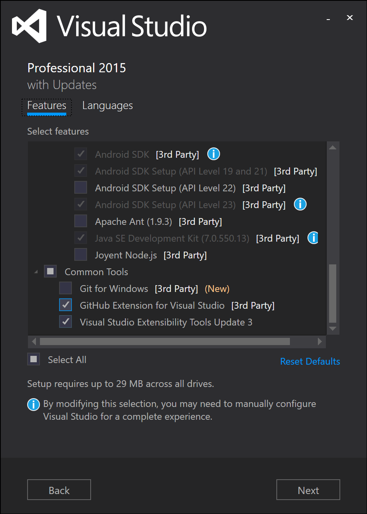
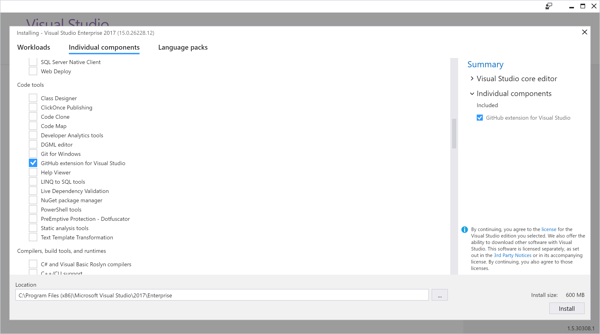
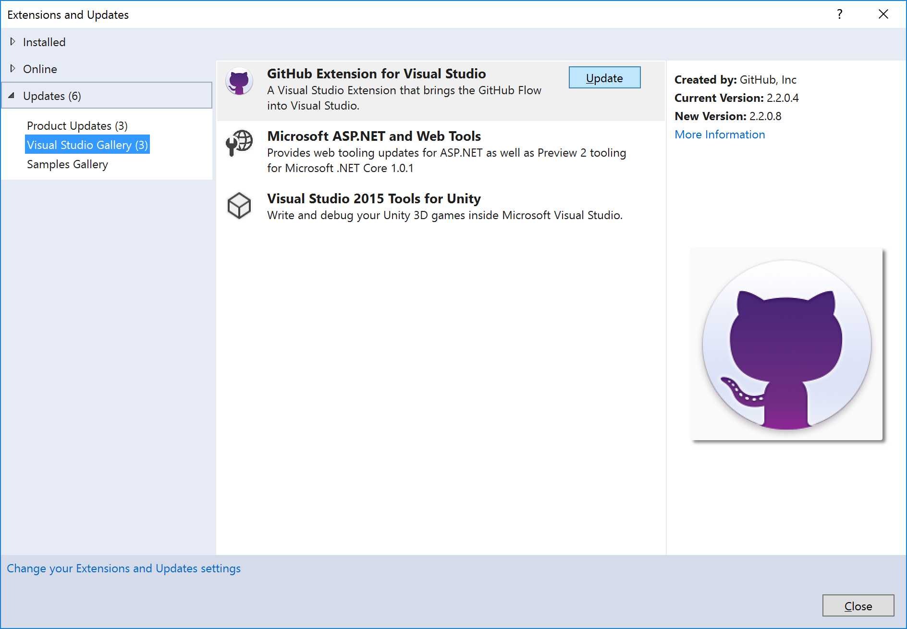

# Installing the GitHub Extension for Visual Studio

GitHub for Visual Studio is an extension for Microsoft Visual Studio 2015 and later. It is not supported on Visual Studio Code, Visual Studio Express or Visual Studio for Mac.

## Installing for all versions of Visual Studio 2015 and higher

If you already have Visual Studio 2015 or higher installed, you can install the extension into all your versions of Visual Studio with the following steps:

1. Visit the [GitHub for Visual Studio](https://visualstudio.github.com/) site.
2. Click the **Download GitHub Extension for Visual Studio** button.
3. In your computer's **Downloads** folder, double-click **GitHub.VisualStudio.vsix**.
4. In the pop-up window, click **Install**.
5. After the installation is completed, run Visual Studio.

## Installing from the Visual Studio gallery

If you're currently running Visual Studio 2015 or higher, you can install the extension from the Visual Studio gallery.

1. In Visual Studio, open the **Tools** menu and click **Extensions and Updates**

2. On the left side of the **Extensions and Updates** dialog, select **Online - Visual Studio gallery**

3. In the search box on the top right side, type **GitHub**

4. Select the **GitHub Extension for Visual Studio** entry and click **Download**

   

5. After installation is completed, restart Visual Studio.

## If you do not have Visual Studio installed yet

When you install Visual Studio, you can include the GitHub Extension for Visual Studio  for installation, as it is available in the Visual Studio installer.

### Visual Studio 2015

**Note:** The Visual Studio 2015 installer is not guaranteed to install the latest version of the extension. Once the Visual Studio installation is complete, [update the extension](#updating-the-extension) from the Visual Studio gallery, or [run the installer](#installing-for-all-versions-of-visual-studio-2015-and-higher) from our website.

1. Start the Visual Studio 2015 installer.
2. Scroll down to **Common Tools** and check **GitHub Extension for Visual Studio**.
   
3. Click the **Install** button.
4. Once installation is complete, run Visual Studio 2015 and [update the extension](#updating-the-extension)

### Visual Studio 2017

**Note:** The Visual Studio 2017 installer is not guaranteed to install the latest version of the extension. Once the Visual Studio installation is complete, [update the extension](#updating-the-extension) from the Visual Studio gallery, or [run the installer](#installing-for-all-versions-of-visual-studio-2015-and-higher) from our website.

1. Start the Visual Studio 2017 installer.

2. Select the **Individual components** tab at the top.

3. Scroll down to **Code tools** and check **GitHub Extension for Visual Studio**.

   

4. Click the **Modify** button.

5. Once installation is complete, run Visual Studio 2017 and [update the extension](#updating-the-extension)

## Updating the extension

**Note:** If you're currently running Visual Studio 2015 or higher and the extension is already installed, Visual Studio will check for and install updates automatically every 24 hours. For this update process to run, Visual Studio must not be running.

Visual Studio 2017 will not run automatic updates until you update the extension at least once.

1. In Visual Studio, open the **Tools** menu and click **Extensions and Updates**
2. On the left side of the **Extensions and Updates** dialog, select **Updates - Visual Studio gallery**
3. If there are updates available, an entry titled **GitHub Extension for Visual Studio** will appear on the list. Select it and click **Update**
   
4. After installation is completed, restart Visual Studio.
